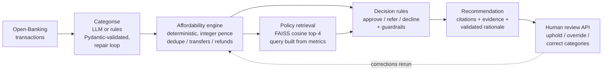

# Affordability Copilot — human-in-the-loop RAG for cashflow underwriting

A prototype that turns **synthetic Open-Banking transaction data** into an
**explainable approve / refer / decline recommendation** for a personal-loan
application — with policy citations, transaction-level evidence, guardrails, a
functional human-review loop, tests, CI and an evaluation harness.

**The design principle: the LLM never makes the credit decision.** A
deterministic, auditable rules engine does. The LLM (when configured) does two
bounded jobs — categorise transactions inside a validated Pydantic contract, and
draft the rationale, which is rejected unless every cited policy ID is either
retrieved or a deterministic decisive-policy ID, and every number appears in the
computed facts. That split is what a
regulated lender needs from GenAI: language and enrichment from the model,
decisions from transparent code, and a human owning the outcome.

> Everything here is synthetic and illustrative: generated data (no real
> customers, no real Open Banking connection), fictional policy documents
> (informed by public FCA CONC 5.2A principles, not any firm's real policy), and
> prototype thresholds. This is a portfolio project, not a production system —
> see [Limitations](#honest-limitations).

## Quickstart

```bash
pip install -r requirements.txt
python run_all.py                  # fully offline: data -> decisions -> evaluation -> reports/report.html

pip install -r requirements-dev.txt
pytest --cov                       # 140 offline deterministic tests (94.9% coverage)

uvicorn app:app --port 8000        # serve the API (docs at /docs)
```

Optional real-model modes (same pipeline, same contracts):

```bash
# local LLM via Ollama (categorisation + generated rationales; needs a local
# Ollama daemon — no extra Python package). Pin an exact model tag and record it:
# LLM_MODEL defaults to the mutable alias `llama3.2`, which is NOT what was measured.
ollama pull llama3.2:3b-instruct-q4_K_M
LLM_MODEL=llama3.2:3b-instruct-q4_K_M LLM_BATCH_SIZE=10 LLM_TIMEOUT_S=180 \
  python run_all.py --provider ollama
# A 3B model cannot hold a 40-item JSON contract inside 60 s: at the defaults every
# batch times out, 100% of items fall back to rules and every case is referred.
# Budget ~4 h for all 53 applicants.

# hosted APIs need their SDKs + keys (not in requirements.lock by design):
#   pip install openai      && export OPENAI_API_KEY=...    # --provider openai
#   pip install anthropic   && export ANTHROPIC_API_KEY=... # --provider anthropic

# sentence-transformer retrieval (all-MiniLM-L6-v2, 384-dim)
pip install sentence-transformers
python run_all.py --embeddings minilm
```

## Pipeline



| Stage | Module | What it does |
|---|---|---|
| Structured categorisation | `src/categorize.py`, `src/schemas.py`, `src/prompts.py` | 21-category taxonomy; batched LLM calls constrained to a Pydantic schema with a validate-and-repair loop and per-item rule fallback — an invalid category, invented ID or altered amount cannot enter the system. Unrecognised **inflows are never income**. |
| Affordability engine | `src/affordability.py` | Deterministic cashflow underwriting in integer pence: duplicate removal, internal-transfer and refund netting, conservative volatile-income assessment, DTI / gambling / distress / unknown-spend metrics — every aggregate traceable to transaction IDs. |
| Policy RAG | `src/retriever.py`, `policy/` | 2 fictional policy docs → 17 section-aligned chunks → TF-IDF (default) or MiniLM vectors → FAISS `IndexFlatIP` over L2-normalised vectors (exact cosine) → top-4 with a score floor. The retrieval query is built from the case's computed risk signals. |
| Decision rules | `src/decision_rules.py` | The only component that picks the outcome. Fixed precedence, env-configurable thresholds, 22 machine-readable warning codes. Guardrails (thin file, no income, coverage gap, unknown/cash share, LLM failure, failed/empty retrieval, transfer-leg imbalance, zero essential spend) always **refer, never auto-decline** on these handled paths. |
| Explanation | `src/agent.py` | Citations assembled deterministically from corpus metadata (verbatim quotes + versions). LLM rationale accepted only if it cites retrieved/decisive IDs and uses only computed numbers; otherwise rejected → template. |
| Human review | `app.py` | Functional HITL API: every response is a recommendation (`human_review_required: true`); reviewers uphold/override with a mandatory reason and correct categories → deterministic recompute. Reviews are CANONICAL: corrected categories/metrics and the final outcome become the assessment's current state (originals retained; chained reviews build on corrections; an uphold that conflicts with its own recompute is rejected). In-memory store — history lost on restart. |
| Serving & ops | `app.py`, `src/obs.py`, `Dockerfile`, `.github/workflows/ci.yml` | Versioned FastAPI (`/v1`), idempotency keys, size limits, request-ID JSON logging with per-stage latency, non-root Docker image (757 MB on disk / 162 MB compressed on `python:3.12-slim`), CI running lint + 140 offline tests on Python 3.11 and 3.12 (installed from the lockfile) + an end-to-end eval smoke run + a Docker build-and-boot job — green on GitHub Actions since the first push. |

## Measured results — separately seeded regression/evaluation set

**The headline configuration is offline and deterministic — rules categoriser,
TF-IDF retrieval, template rationales, zero LLM calls** — because it is the
CI-stable, exactly reproducible one. Three further configurations have been
measured with the same harness and are reported below: dense (MiniLM) retrieval,
a live local `llama3.2:3b-instruct-q4_K_M`, and a total provider outage. Eval
set: 32 applicants / 4,567 transactions (seed 4242, jittered parameters,
generated separately from the 21-applicant dev set — but used during development
to verify label consistency, so it is a **regression set, not a blind test
set**).

| Metric | Result | Detail |
|---|---|---|
| Decision consistency (accuracy vs intent labels) | **32/32** | per-class P/R 1.0; confusion diagonal 11/15/6; false-positive referrals 0 |
| Expected-warning recall | **17/17** | 17 expected instances across 12 distinct codes (8 guardrail-severity + 9 review-severity), each code individually 100%; data-treatment checks 3/3 |
| Retrieval — runtime-decisive coverage@4 | **40/40** | the policy IDs the rules engine ACTUALLY used, found in the top-4; case-level 32/32. Labelled expected policy-ID instances: 37/37 (17 distinct corpus sections). Top-1 relevance 53.1%. Two real iterations: query v2 fixed a refund-vs-transfer miss; query v3 added loan-INCLUSIVE signals after an audit showed DTI-driven declines retrieved nothing about the DTI limit |
| Grounding-check pass ("faithfulness") | **32/32** | deterministic structural checks: ≥1 citation ∧ verbatim corpus quotes ∧ cited IDs ∈ retrieved∪decisive ∧ every number ∈ computed facts (percentage forms allowed for ratio facts only). **Not** semantic entailment or usefulness — see docs/EVALUATION.md |
| Transaction categorisation | **95.9%** (4,567 labelled, all 21 categories supported) | every error is an ambiguous merchant → `unknown` (abstention); **0** income-inflation and **0** debt-deflation errors; unknown rate 4.3%; 20 of 21 categories at ≥88% recall |
| Pipeline latency (in-process, not HTTP) | p50 ≈4 ms · p95 ≈6 ms | per stage (p50, ms): categorise ≈2 · affordability ≈0.9 · retrieve ≈0.7 · decide ≈0.03 — per-run figures in `reports/eval_summary.json` (timing fields vary run-to-run; metric values reproduce identically) |

Read these honestly: expected labels are scenario-intent labels verified
consistent with the rules engine, so decision consistency demonstrates
**synthetic pipeline integrity and categorisation robustness** (ambiguous
merchants, refunds, transfers, duplicates, injection strings did not flip any
decision), not real-world lending performance — the full caveats are in
[docs/EVALUATION.md](docs/EVALUATION.md).

### Live local LLM — `llama3.2:3b-instruct-q4_K_M` (2026-08-02)

Same harness, same set, run **entirely locally** (digest `a80c4f17acd5`, Ollama
0.32.5, batch 10, timeout 180 s): the model categorises transactions and drafts
rationales, and still has no vote on the outcome.

| Metric | Deterministic | Live 3B model |
|---|---|---|
| Decision consistency | 32/32 | **31/32** — one disagreement, and it is in the unsafe direction (refer → approve) |
| Expected-warning recall | 17/17 | **14/17** — `dti_borderline` and `income_volatility_high` did not fire |
| Retrieval — labelled@4 | 37/37 | 35/37 · top-1 relevance 53.1% → **28.1%** |
| Grounding-check pass | 32/32 | 32/32 — **but only 8 of 32 rationales are the model's own**; the validator rejected 24 |
| Categorisation | 95.9%, 0 + 0 critical | **60.4%**, **3 income-inflation + 33 debt-deflation** |
| Structured-output contract | n/a | 97.0% first-pass valid · 3.8% item fallback · **22 invented policy IDs rejected** |
| End-to-end p95 | ≈6 ms | **307 s** |

**This is a model-selection result, not a system failure.** The contracts held —
schema validation, repair, per-item fallback and the citation validator all did
their jobs — and the model still is not fit for the categorisation step at this
size. The single unsafe decision is the finding: 33 committed repayments were
labelled as ordinary spending (mostly `rent_mortgage`), which does not change
total outgoings or disposable income but *does* lower DTI, so a borderline
applicant dropped out of the manual-review band. The error is invisible to the
affordability arithmetic and visible only in the ratio — and the guardrail that
would have caught it is the one the error disabled. `debt_deflation` is now a
counted critical-error class precisely because of this.

Two further configurations are reported in [docs/EVALUATION.md](docs/EVALUATION.md):
**MiniLM dense retrieval**, which is worse than TF-IDF on every retrieval measure
and ~16× slower on this small, vocabulary-controlled corpus; and a **total
provider outage**, in which all 32 applicants were referred, none approved or
declined — the designed degradation path, observed live.

Retained evidence: `reports/`, `reports_minilm/`, `reports_llm_v3/`,
`reports_llm_outage/`, and `reports_llm_llama32_3b/` (the pre-fix live run that
exposed three defects in the guardrails and validators — kept deliberately),
plus `pytest_coverage.txt`, `coverage.xml` and `docker_build_sandbox.log`.

## API

```
GET  /health · /ready · /version
POST /v1/decision                      assessment (201; idempotency_key supported)
GET  /v1/assessments                   reviewer worklist
GET  /v1/assessments/{id}              full record (?include_transactions=true)
POST /v1/assessments/{id}/review       uphold/override + category corrections -> recompute
```

Example response shape (abridged):

```json
{
  "assessment_id": "ASMT-00001-a1b2c3",
  "decision": {
    "outcome": "refer",
    "guardrail": "insufficient_history",
    "warnings": [{"code": "insufficient_history", "severity": "guardrail", "message": "..."}],
    "policy_citations": [{"policy_id": "POL-007", "version": "2026-07.2", "quote": "..."}],
    "rationale": "... [POL-007].",
    "human_review_required": true,
    "versions": {"engine": "2.0.0", "prompts": "v3", "llm": "deterministic"}
  },
  "metrics": {"monthly_income_assessed": 2600.0, "evidence": {"eligible_income": ["TX-..."]}}
}
```

## Configuration

All policy thresholds are environment-overridable (see `src/config.py`):
`BUFFER_GBP=150`, `DTI_REFER=0.40`, `DTI_MAX=0.45`, `GAMBLING_REFER=0.10`,
`VOLATILITY_MAX=0.35`, `MIN_MONTHS=3`, `MIN_TRANSACTIONS=40`,
`MAX_UNKNOWN_SHARE=0.10`, `MAX_CASH_SHARE=0.25`, `DISTRESS_MAX=2`, plus
`LLM_PROVIDER`, `LLM_MODEL`, `EMBEDDINGS`, `RETRIEVAL_K=4`.

## Project structure

```
data/generate_data.py   seeded synthetic Open-Banking generator (dev seed 11 / eval seed 4242)
policy/                 fictional policy corpus (16 sections, versioned)
src/                    schemas · config · prompts · llm · categorize · affordability ·
                        decision_rules · retriever · agent · evaluate · obs · dataio
app.py                  FastAPI service + human-review loop
run_all.py              end-to-end runner -> reports/
tests/                  140 offline deterministic tests + 2 optional MiniLM tests (94.9% coverage)
                        conftest.py clears all 32 config env vars: the suite is hermetic
docs/                   ARCHITECTURE · DECISIONS (ADRs) · EVALUATION
```

## Honest limitations

**The headline metrics involve zero LLM calls** — they measure the deterministic
configuration. One live configuration has been measured (local
`llama3.2:3b-instruct-q4_K_M`, above) and scores materially lower; **hosted**
provider behaviour, live prompt-injection behaviour, token usage and cost per
assessment remain unmeasured, and no paid API call has ever been made (total
spend £0). No real data, no real Open Banking API, no real users, and never
deployed beyond local and container runs. Default model names (`llama3.2`,
`gpt-4o-mini`, `claude-3-5-haiku-latest`) are mutable aliases — pin exact tags,
and note that the measured run used the digest `a80c4f17acd5`. Storage is
in-memory; there is no authentication; fairness is **not** established, and
synthetic data cannot establish it; thresholds are invented; the fictional policy
corpus was not reviewed by a compliance professional; the reviewer flow is
API-only with no UI; and load, concurrency and reviewer usefulness are
deliberately unmeasured rather than estimated. Each limitation and the path to
production is discussed in [docs/DECISIONS.md](docs/DECISIONS.md).

## License

MIT — see [LICENSE](LICENSE).
